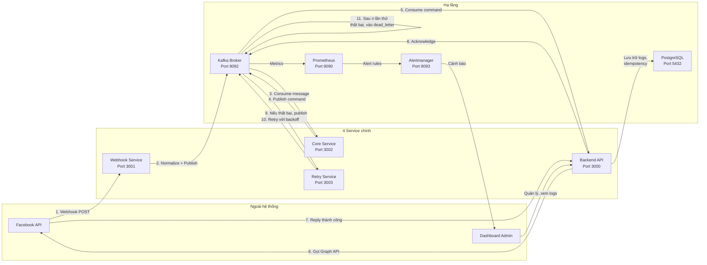

# TrangKimDat_6451071018_BTTH_N2 - Hệ thống Chatbot Automation

## 1. Tổng quan kiến trúc

Hệ thống gồm **4 service chính** và **hạ tầng đi kèm (infrastructure)**. Mỗi service là một thư mục riêng, muốn chạy service nào thì vào thư mục đó.

```
TrangKimDat_6451071018_BTTH_N2/
├── webhook-service/        # Service 1 - Nhận webhook từ Facebook
├── core-service/           # Service 2 - AI phân loại, automation rule engine
├── backend-api/            # Service 3 - Gọi Facebook Graph API, gửi reply
├── retry-service/          # Service 4 - Retry với exponential backoff
│
├── kafka-broker/           # Hạ tầng: Message broker (Kafka)
├── kafka-ui/               # Hạ tầng: Giao diện quản lý Kafka
├── kafka-exporter/         # Hạ tầng: Prometheus exporter cho Kafka
├── prometheus/             # Hạ tầng: Thu thập metrics
├── alertmanager/           # Hạ tầng: Gửi cảnh báo
└── docker-compose.yml      # Chạy toàn bộ hạ tầng
```

## 2. Sơ đồ luồng dữ liệu



## 3. Chi tiết 4 service chính

### 3.1. Webhook Service (Port 3001)

**Trách nhiệm:** Nhận webhook từ Facebook, verify HMAC signature, normalize dữ liệu, publish vào Kafka.

**Luồng xử lý:**
1. Nhận POST `/webhook` từ Facebook
2. Verify HMAC signature (X-Hub-Signature-256)
3. Normalize dữ liệu webhook thành message chuẩn
4. Kiểm tra idempotency (tránh xử lý trùng lặp)
5. Publish message vào Kafka topic `facebook-events`
6. Trả về 200 OK cho Facebook

**Các topics Kafka:**
- `facebook-events` — dữ liệu thô từ webhook
- `facebook-commands` — lệnh cần thực thi (gửi reply, ẩn comment...)

### 3.2. Core Service (Port 3002)

**Trách nhiệm:** AI phân loại intent/sentiment, automation rule engine, quyết định hành động.

**Luồng xử lý:**
1. Consume message từ Kafka topic `facebook-events`
2. Phân tích nội dung comment:
   - **Intent detection:** hỏi giá, hỏi size, khen, phàn nàn...
   - **Sentiment analysis:** tích cực, tiêu cực, trung lập
3. Áp dụng automation rule engine:
   - Nếu intent = "hỏi_giá" → quy tắc: reply tự động với thông tin giá
   - Nếu sentiment = "tiêu cực" → quy tắc: cảnh báo admin
   - Nếu sentiment = "tích cực" → quy tắc: reply cảm ơn
4. Publish command vào Kafka topic `facebook-commands`

### 3.3. Backend API (Port 3000)

**Trách nhiệm:** Gọi Facebook Graph API thực tế, kiểm tra idempotency, gửi reply.

**Luồng xử lý:**
1. Consume command từ Kafka topic `facebook-commands`
2. Kiểm tra idempotency key (tránh gửi trùng)
3. Gọi Facebook Graph API:
   - POST `/{post_id}/comments` — gửi reply
   - POST `/{comment_id}/comments` — ẩn comment
4. Log request/response vào PostgreSQL
5. Acknowledge message trên Kafka
6. Nếu Facebook trả lỗi 5xx hoặc 429 → Ném lỗi vào Kafka retry topic

**API REST cho Dashboard Admin:**

| Method | Endpoint | Auth | Mô tả |
|--------|----------|------|--------|
| POST | /api/auth/login | Không | Đăng nhập, trả JWT |
| GET | /api/posts | JWT + Admin | Lấy danh sách bài viết |
| POST | /api/posts | JWT + Admin | Đăng bài viết mới |
| GET | /api/comments/:postId | JWT + Admin | Lấy bình luận |

### 3.4. Retry Service (Port 3003)

**Trách nhiệm:** Retry các message thất bại với exponential backoff, chuyển vào dead-letter queue khi hết lần thử.

**Luồng xử lý:**
1. Consume message từ Kafka retry topic
2. Đọc số lần thử đã thực hiện
3. Nếu chưa đạt max retries → exponential backoff rồi publish lại
4. Nếu đã đạt max retries → publish vào dead-letter topic
5. Phát cảnh báo qua Alertmanager

**Chiến lược retry:**
- Lần 1: chờ 1 giây
- Lần 2: chờ 2 giây
- Lần 3: chờ 4 giây
- Lần n: chờ 2^n giây
- Sau 5 lần thử → dead-letter

## 4. Hạ tầng (Infrastructure)

### 4.1. Kafka Broker

- Message broker chính của hệ thống
- Port: 9092
- Các topics: `facebook-events`, `facebook-commands`, `facebook-retry`, `facebook-dead-letter`

### 4.2. PostgreSQL

- Lưu trữ: logs, idempotency keys, comments metadata, admin users
- Port: 5432
- Các bảng chính:
  - `api_logs` — log mọi request/response Facebook
  - `idempotency_keys` — tránh xử lý trùng
  - `comments` — metadata bình luận (intent, sentiment, status)
  - `admin_users` — tài khoản admin

### 4.3. Prometheus

- Thu thập metrics từ các service và Kafka
- Port: 9090
- Metrics: số request/response, latency, số lỗi, số retry...

### 4.4. Alertmanager

- Gửi cảnh báo khi có sự cố
- Port: 9093
- Cảnh báo khi: retry nhiều lần thất bại, Kafka consumer lag cao, service down

### 4.5. Kafka UI

- Giao diện web quản lý Kafka (topics, consumers, messages)
- Port: 8080

### 4.6. Kafka Exporter

- Export Kafka metrics cho Prometheus
- Port: 9308

## 5. Cách chạy từng service

```bash
# Webhook Service
cd webhook-service && npm install && npm start

# Core Service
cd core-service && npm install && npm start

# Backend API
cd backend-api && npm install && docker compose up -d && npm start

# Retry Service
cd retry-service && npm install && npm start
```

## 6. Các bài tập đã hoàn thành

| Bài | Mô tả | Trạng thái |
|-----|-------|-----------|
| Bài 1 | Tích hợp Facebook API và Backend (Backend API) | Hoàn thành |
| Bài 2 | Webhook Service, Core Service, Retry Service, Kafka Infrastructure | Hoàn thành |
| Bài 3 | AI Sentiment Analysis, Automation Rule Engine, Retry/CircuitBreaker/Idempotent/DLQ | Hoàn thành |
